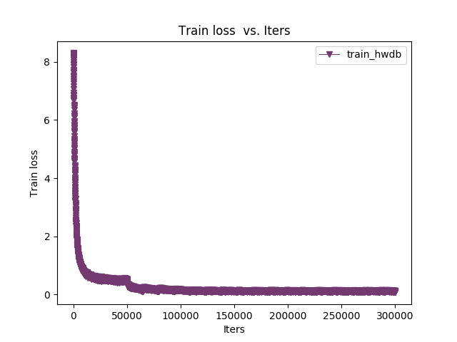
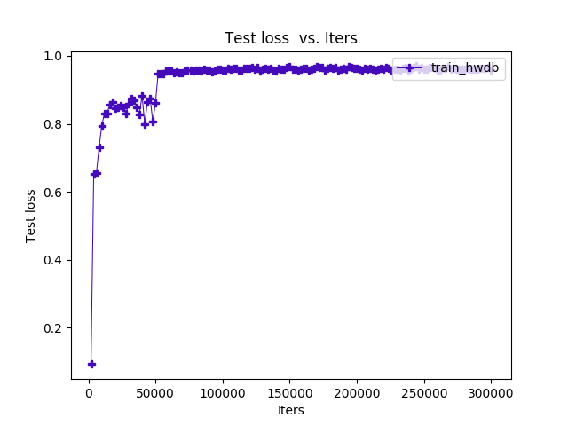

### HWDB-1.1 手写汉字CNN识别模型训练

---

#### 数据集

使用CASIA-HWDB1.1进行训练和测试，训练集和测试集按照4:1划分，测试集235200张，训练集940800张，

共计1,176,000张图像。该数据集由300个人手写而成，其中包含171个阿拉伯数字和特殊符号，3755类GB2312-80 level-1汉字。

http://www.nlpr.ia.ac.cn/databases/handwriting/Download.html

- 样例图

  

  

  

  

  

#### 模型训练

- **Finetuning from a pretrained model**

  以googlenet为基础模型，进行finetuning。直接训练全部类别无法收敛时，尝试分阶段训练。

  训练后的测试结果为loss-1和loss-2分支准确率为95%，loss-3分支为97%。收敛很快，以0.01为基础学习率，32的batch size，不到10000次迭代就收敛了。

  

- **Train 'HWDB-CNN-9Layer' model**

  虽然googlenet效果尚可，但是由于网络设计的历史原因，全连接层没有用avg_pooling，所以输入时需要强行把图像放大到224*224，且输入是3通道，对于字符来说有点浪费资源。决定按照论文<https://arxiv.org/abs/1702.07975>重头撸一个轻量点的模型。

  这个论文里的模型比较简单，就是很基本的结构（模型图太长，不贴了）。
  加了BN（注意BN以及一些特殊层训练和deploy的区别），训练过程收敛也很快，过程图如下：

  

  

- 前传时间及模型大小对比

  googlenet:  0.46ms/张，89.5MB

  HWDB-CNN-9Layer:  0.205ms / 张,  44.2MB

  

